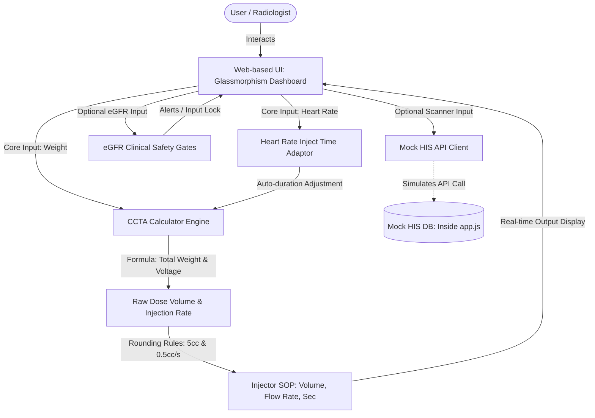

# Spec: CCTA Contrast Dose Calculator Web App

## Objective
Create a premium, web-based CCTA (Coronary Computed Tomography Angiography) contrast dose calculator for clinical radiology staff. The tool optimizes contrast medium protocols for patient safety and image quality based on physical parameters, heart rate, kidney function (eGFR), and drug concentration.

It will support two operation modes:
1. **Core Inputs Mode (Default):** Clinicians input gender, height (cm), weight (kg), and heart rate (bpm) to get recommended contrast volume (mL) and injection flow rate (mL/s) instantly.
2. **HIS Integration Simulator:** A barcode scanning/mock HIS integration interface that retrieves patient data from a mock database and auto-fills parameters.

## Core Calculation Rules
- **Calculation Basis:** Defaults to Total Weight to ensure optimal CCTA vessel opacification and prevent underdosing.
- **Volume Rounding:** Recommended contrast volume is rounded to the nearest **5 cc** step (minimum 20 cc).
- **Flow Rate Rounding:** Recommended injection flow rate is rounded to the nearest **0.5 cc/s** step (minimum 1.0 cc/s).
- **Duration & IDR:** Actual injection duration and Iodine Delivery Rate (IDR) are recalculations based on the rounded volume and flow rate.

## Tech Stack
- **Core:** HTML5 (semantic layout), JavaScript (ES6+ modular logic bundled in standard script tag for CORS-free local preview)
- **Styling:** Modern Vanilla CSS (featuring CSS Grid, Flexbox, CSS Variables, glassmorphism, responsive styling, dark/light theme, and heart beat pulsing animations)
- **Font & Icons:** Google Fonts (Outfit & Inter), Lucide Icons (CDN)
- **Deployment & Server:** Standard static web server, or direct file access via double-click on `index.html`.

## Conceptual Map (Upstream Diagram)


## Commands
This is a static web application. It can be opened directly in the browser via file protocol or served locally.
- **Start Dev Server:** `npx -y http-server "f:/github/ccta contrast" -p 8080` (or double-click `index.html` directly)
- **Format / Lint:** Standard HTML/CSS format check.

## Project Structure
```
f:/github/ccta contrast/
├── spec.md                # This specification document
├── index.html             # Main web page structure
├── style.css              # Custom Vanilla CSS styling
├── app.js                 # Unified Javascript controller & mock database
└── README.md              # User instructions and documentation
```

## Code Style
- **Naming Conventions:** camelCase for variables/functions, PascalCase for classes, kebab-case for CSS classes.
- **Direct File Compatibility:** Avoid imports/exports. Load `app.js` using standard script tag `<script src="app.js"></script>` to bypass CORS blocks on local double-click.

## Testing & Validation Strategy
- **Manual Verification Matrix:** Test with known medical scenarios:
  1. Male (172 cm, 68 kg, HR 60 bpm, Iopamiro 370, 80 kVp multiplier 1.0, Weight coef 270):
     - Raw Contrast Volume: `68 * 270 / 370 = 49.62 mL` -> Rounded to nearest 5cc is **50 cc** (Correct).
     - Target Duration: 12 seconds.
     - Raw Flow Rate: `50 / 12 = 4.17 mL/s` -> Rounded to nearest 0.5 cc/s is **4.0 mL/s** (Correct).
     - Actual Injection Time: `50 / 4.0 = 12.5 seconds` (Correct).
     - IDR: `4.0 * 370 / 1000 = 1.48 g I/s` (Correct).
  2. Heart Rate Check:
     - HR = 60 bpm (< 65) -> Injection Duration automatically set to 12.0 seconds.
     - HR = 70 bpm (65 - 75) -> Injection Duration automatically set to 11.0 seconds.
     - HR = 80 bpm (> 75) -> Injection Duration automatically set to 10.0 seconds.
  3. eGFR Check:
     - 50 -> Clear, normal state.
     - 35 -> Warning banner.
     - 25 -> Lock screen / Lock inputs & calculate buttons, show override protocol.
- **CORS-free verification:** Double-click `index.html` directly in explorer and verify calculations work instantly without console errors.

## Binary Acceptance Metrics
- [ ] Dose calculation defaults to weight-based, and intermediate metrics display BMI and total weight details.
- [ ] Recommended A-syringe volume rounds to the nearest 5 cc, and recommended flow rate rounds to the nearest 0.5 cc/s.
- [ ] Heart rate inputs automatically adjust injection duration slider and values according to clinical rules.
- [ ] Actual duration and IDR update in real-time based on rounded output values.
- [ ] Safe-gate eGFR checks dynamically enable/disable controls and show color-coded alerts (Green, Orange, Red) exactly as specified.
- [ ] Scan simulator retrieves patient parameters successfully from mock database via input/simulate click.
- [ ] Application styling matches premium guidelines: dark mode, glassmorphism, responsive, and contains no raw unstyled native inputs.
